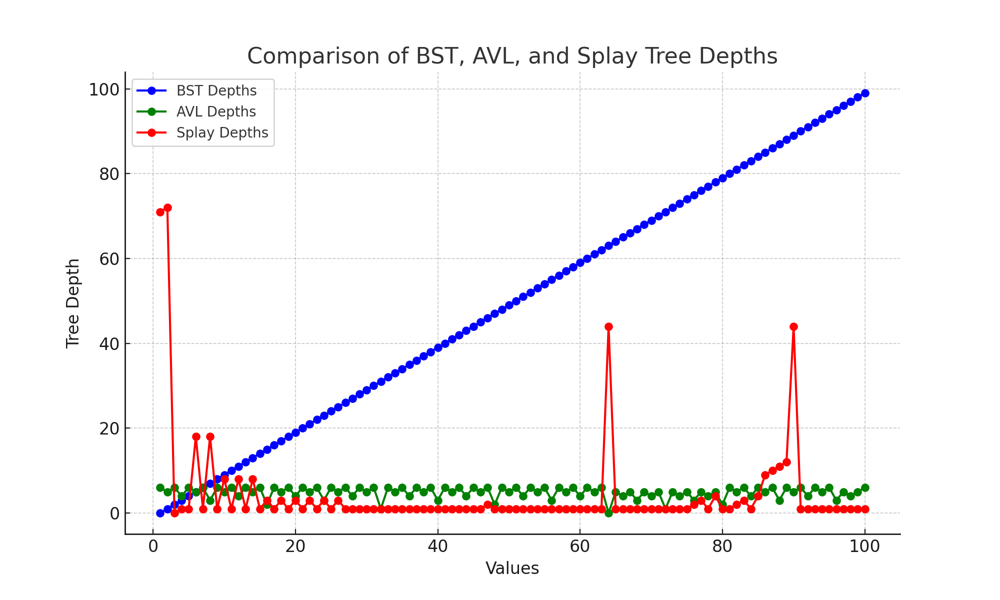

# Project 3 Report

Answer the following questions directly in this file:
* You will have a different grader again, so make sure your report includes information about your dataset.
* How do the depths of the random-ordered integers compare to the depths of the ordered integers for each tree? Why?
* How do the depths of each custom-data-type tree compare to each other?
* Why do the depths of the second custom-data-type Splay Tree make sense?
* Graph the Binary Search Tree, AVL Tree, and Splay Tree depths for the custom data type trees. Do not use C++ to graph, you can use whatever spreadsheet application or graphical programming language you prefer. You can use whatever graph is most readable to you (e.g. scatter plot, histogram, etc.).
  * Your graphs should have clear labels for both x and y axes.
  * Save your graph files in the graphs folder.
  * You do not need to graph the depths of the integer type trees or the Splay Tree that finds each object 5 times in a row, but you can if you feel it helps you analyze the data.
  * An example graph spreadsheet and an example graph image have been included in the starter code.
  * Here is how you include an image in your Report.md file: 
* Compare and contrast the graphs and explain the differences based on what you know about the structure and behavior of the trees. Justify the time complexity of searching the trees based on the results.

**Note: Any code that was not authored by yourself or the instructor must be cited in your report. This includes the use of concepts not taught in lecture.**

Dataset Information: I found my dataset from a website called "Kaggle". Each of my attributes represent different but relevant parts of a movie. I have the title of the movie, the certificate/age restriction of the movie, I have the movies run time in minutes(Duration), the
genre/theme of the movie, the description of the movie (what it is about/main plot of movie), the cast which involves the main actors and the director, and info
This is the gross income of the movie and the amount of votes it garnered by the people for movie of the year.

Comparison of random and ordered integers in the depths of trees.
BST (Binary Search Tree): When ordered data is inserted into a BST, it results in a degenerate tree where the depth increases in a linear manner. This is why the heights of ordered integers in the BST are expected to be significantly greater than for random integers.
AVL Tree: AVL trees are designed to automatically balance themselves, resulting in similar depths for both randomly and sequentially ordered integers due to their logarithmic depth guarantee.
Splay trees adapt their structure during each access as well. Yet, organized data can result in the tree still experiencing periods of increased depth due to constant node reorganization. The depth for random data would change depending on the access patterns.

Comparing Depths of Custom Data Type Trees:
The variances among BST, AVL, and Splay trees show in how they handle balancing. Anticipate the AVL tree having consistent, shallow depths from strict balancing, while the Splay Tree may have depth peaks but usually evens out with frequent access. If the custom data types are arranged in a specific sequence, the BST will probably exhibit more depth.
The reasons behind the Splay Tree Depths for the Second Custom Data Type: The high points in depth of the Splay Tree probably stem from certain nodes starting out deep and later moving closer to the root through splaying. This action is logical since Splay Trees relocate often used elements nearer to the root, decreasing future access durations.
The depth of each tree structure is clearly illustrated in the graph you have provided for BST, AVL, and Splay Tree. The blue BST depths increase in a linear fashion, showing imbalance when data is in order. The AVL Tree depths (green) remain constant and not very deep, showing the tree's equilibrium. The depth of the Splay Tree (shown in red) spikes initially when nodes are deep, but decreases as nodes are accessed and moved closer to the root.

Justification of Comparison and Time Complexity Comparisons:
BST: When not balanced, the time complexity can drop to O(n) when dealing with ordered data, as indicated by the significant depths.
AVL Tree: The balancing guarantees a logarithmic depth, resulting in O(log n) time complexity for search operations, in line with the shallow depths observed in the graph.
Splay trees have an average time complexity of O(log n), so although some operations may be slow, repeated accesses to the same node are quicker.

